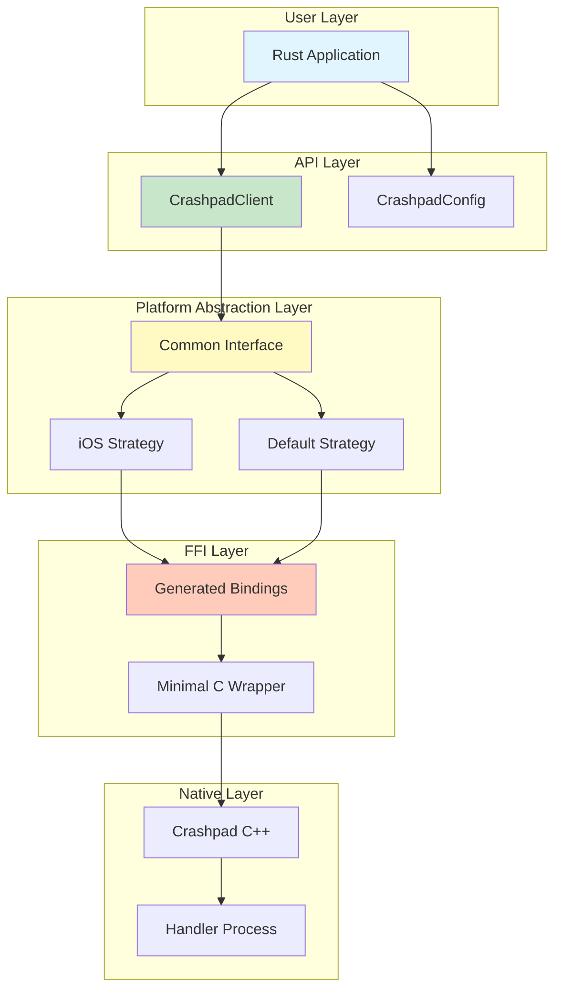

<!-- DOCGUIDE HEADER
Version: 1.0
Generated: 2025-08-05
Project Type: Rust FFI Wrapper Library
Primary Language: Rust
Frameworks: Crashpad (C++), bindgen
Last Updated: 2025-08-05
Update Command: claude commands/scaffold/architecture.md
-->

# Architecture Overview

crashpad-rs is a Rust wrapper library that makes Google Crashpad easy to use from Rust. It abstracts away the complexity of the C++ build system and platform-specific differences, allowing Rust developers to implement crash reporting with just a few lines of code.

## Core Design Principles

### Simplicity Above All
The primary goal is to make crash reporting trivial for Rust developers. Complex C++ APIs and build systems should be invisible to the end user.

### Platform Abstraction
Differences between platforms (especially iOS's in-process model vs others' out-process model) should be handled transparently without leaking into user code.

### Minimal Surface Area
Expose only what's necessary. Start with the smallest useful API and expand only when real use cases demand it.

### Zero-Cost Wrapper
The Rust wrapper should add no runtime overhead. All abstractions should compile away.

### Progressive Disclosure
Simple use cases should be simple. Advanced features should be possible but not required for basic usage

## Architectural Layers



## FFI Design Philosophy

### Principle of Least Commitment
The FFI layer commits to the minimum necessary interface. This ensures:
- Future Crashpad changes have minimal impact
- The wrapper remains maintainable by a small team
- New features can be added without breaking existing ones

### Idiomatic Rust Patterns

#### RAII for Resource Management
```rust
// Resources are tied to Rust object lifetime
let client = CrashpadClient::new()?;  // Acquires resources
// ... use client ...
// Automatically cleaned up when dropped
```

#### Builder Pattern for Configuration
```rust
// Flexible, extensible configuration
let config = CrashpadConfig::builder()
    .database_path("./crashes")
    .url("https://crashes.example.com")
    .build();
```

#### Result-Based Error Handling
```rust
// All fallible operations return Result
client.start_with_config(&config)?;
```

### Wrapper Evolution Strategy

The wrapper follows a strict evolution path:
1. **Additive Only**: New functions can be added, existing ones remain stable
2. **Opt-in Complexity**: Advanced features are opt-in, not default
3. **Version Boundaries**: Breaking changes only at major versions

## Platform Abstraction Philosophy

### Unified Interface, Divergent Implementation

The library presents a single interface regardless of platform, but internally uses platform-specific strategies:

```rust
// User code remains the same across platforms
let client = CrashpadClient::new()?;
client.start_with_config(&config)?;
```

### iOS as First-Class Citizen

iOS's unique constraints drive several architectural decisions:

1. **In-Process Model**: No external processes allowed on iOS
2. **Two-Phase Processing**: Capture at crash time, process on next launch
3. **Intermediate Format**: iOS-specific format before minidump conversion
4. **Memory Pressure**: Minimal allocations during crash handling

These constraints inform the overall API design, ensuring it works naturally on the most restrictive platform.

### Platform Strategy Pattern

```rust
// Internal platform strategies (not exposed to users)
trait PlatformStrategy {
    fn start_handler(&self, config: &Config) -> Result<()>;
    fn capture_context(&self) -> Result<()>;
}

struct IOSStrategy;     // In-process handler
struct DefaultStrategy; // Out-process handler
```

## API Design Principles

### Convention Over Configuration

Sensible defaults that work for 90% of use cases:
```rust
// This just works
let client = CrashpadClient::new()?;
client.start_with_config(&CrashpadConfig::default())?;
```

### Progressive Disclosure of Complexity

```rust
// Level 1: Basic usage
let client = CrashpadClient::new()?;

// Level 2: Custom configuration
let config = CrashpadConfig::builder()
    .database_path("./crashes")
    .build();

// Level 3: Advanced features (future)
client.set_annotation("version", "1.2.3");
```

### Fail-Safe, Not Fail-Fast

Crash reporting should never crash the application:
- Missing handler → Log warning, continue running
- Network failure → Store locally, retry later
- Permission denied → Degrade gracefully

### Semantic Versioning as Contract

- 0.x.y: API may change between minor versions
- 1.x.y: API stable within major version
- Breaking changes require major version bump

## Build System Design Principles

### Complete Encapsulation
The Chromium build complexity (depot_tools, gclient, gn, ninja) is completely hidden from users. The build process should be:
- **Automated**: No manual steps required
- **Reproducible**: Same inputs → same outputs
- **Self-contained**: All dependencies managed internally

### Maintainability Through Simplicity
The build script follows the principle of "boring is good":
- Clear, linear flow
- Minimal conditional logic
- Comprehensive error messages
- No clever tricks

## Development Principles

### Rust Ecosystem Integration

The library should feel native to Rust developers:
- **Cargo-centric**: Everything through `cargo build`, `cargo test`
- **docs.rs compatible**: Full documentation available online
- **CI/CD friendly**: Works in containerized environments
- **Cross-compilation aware**: Respects Rust target triple

### Testing Philosophy

```rust
// Unit tests for logic
#[test]
fn test_config_builder() { ... }

// Integration tests for FFI boundary
#[test]
fn test_handler_spawning() { ... }

// Platform-specific tests
#[cfg(target_os = "ios")]
#[test]
fn test_in_process_handler() { ... }
```

### Continuous Evolution

The library evolves based on:
1. **Real Usage**: Features driven by actual user needs
2. **Upstream Changes**: Adapt to Crashpad evolution
3. **Platform Changes**: Support new platforms/architectures
4. **Rust Evolution**: Adopt new language features when stable

## Design for Change

### Extensibility Points

The architecture includes specific extension points:

1. **Platform Strategies**: New platforms can be added without changing existing code
2. **Configuration Options**: Builder pattern allows new options without breaking changes
3. **Hook Points**: Future callback mechanisms for custom behavior
4. **Metadata System**: Extensible annotation/metadata framework

### Non-Goals

Explicitly not in scope (to maintain focus):
- Crash analysis or symbolication
- Custom minidump format extensions
- Direct database manipulation
- Cross-process debugging features

These boundaries ensure the library remains maintainable and focused on its core purpose.

## Related Documentation

- [README.md](README.md) - Quick start guide
- [DEPLOYMENT.md](DEPLOYMENT.md) - Production deployment guide
- [CLAUDE.md](CLAUDE.md) - Development history and build issues